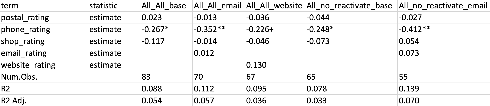

---
output:
  hugodownplus::md_document:
    use_boxes: TRUE
    toc: TRUE
# Documentation: https://sourcethemes.com/academic/docs/managing-content/

title: "Mastering the Many Models Approach"
subtitle: "A Comprehensive Guide to the Tidyverse Many Models Approach and its Extensions"
summary: "This blog post reviews the basic many models approach, updates it using the current tidyverse syntax, and  expands upon the original approach by introducing new building blocks and helper functions."
authors: []
tags: ["R", "dplyr", "base R"]
categories: ["R", "dplyr", "base R"]
date: 2023-03-31
lastmod: 2023-03-31
featured: false
draft: false

# Featured image
# To use, add an image named `featured.jpg/png` to your page's folder.
# Focal points: Smart, Center, TopLeft, Top, TopRight, Left, Right, BottomLeft, Bottom, BottomRight.
image:
  caption: ""
  focal_point: ""
  preview_only: false

# Projects (optional).
#   Associate this post with one or more of your projects.
#   Simply enter your project's folder or file name without extension.
#   E.g. `projects = ["internal-project"]` references `content/project/deep-learning/index.md`.
#   Otherwise, set `projects = []`.
projects: []
---

```{r setup, include=FALSE}
knitr::opts_chunk$set(echo = TRUE)

eframe <- function (..., .noWS = NULL, .renderHook = NULL) {
  htmltools:::validateNoWS(.noWS)
  contents <- rlang::dots_list(...)
  htmltools::tag("e-frame", contents, .noWS = .noWS, .renderHook = .renderHook)
}
```

## Intro

The tidyverse "many models" approach was formally introduced in the first edition of <a href="https://r4ds.had.co.nz/many-models.html" role="highlight" target="_blank">R for Data Science</a> (R4DS) in 2017. Since then, the tidyverse has evolved significantly, and along with it, the way we can harness the many models approach. This blog post aims to i) review the basic approach and update it using the latest tidyverse syntax, and ii) explore a range of use cases with increasing complexity while introducing new building blocks and helper functions.

The structure of this blog post also reflects my motivation for writing it. I think that this is a powerful approach that should be more widely known. Those who are actually using it, often rely on an older syntax, which makes things more complicated than necessary. In addition to the original building blocks, there are several lesser-known functions that help apply this approach to more complex use cases.

Lately, the tidyverse many models approach hasn't received much attention. One might expect this to change with the coming release of the <a href="http://r4ds.hadley.nz" role="highlight" target="_blank">second edition of R4DS</a>. However, the entire section on modeling has been omitted from this release. According to the authors, the reasons for this are twofold: First, there was never ample room to address the whole topic of modeling within R4DS. Second, the authors recommend the 'tidymodels' packages, which are well documented in <a href="https://www.tmwr.org" role="highlight" target="_blank">Tidy Modeling with R</a> which is filling the gap.

While 'tidymodels' is a strong framework with definite advantages when working with various algorithms and model engines, it comes with considerable conceptual and syntactic overhead. For this reason, I believe there is still a lot of room (and use cases) for the "classic" tidyverse many models approach, which is based on 'dplyr' syntax but utilizes base R, or alternatively package-specific, models.

But before we delve into the use cases, let's begin with the setup.

## Setup

Unlike the name suggests, we don't need all of the 'tidyverse' packages for the tidyverse many models approach. The heavy lifting is done by 'dplyr' and 'tidyr'. Additionally, we use 'rlang' and 'purrr' for some extra functionality. In this post we'll be using the `csat` and `csatraw` data from my own package 'dplyover'.

```{r, warning=FALSE, message=FALSE}
library(dplyr)        # <- necessary
library(tidyr)        # <- necessary
library(broom)        # <- necessary
library(rlang)        # <- nice to have
library(modelsummary) # <- for output
library(purrr)        # <- not really needed
library(dplyover)     # <- only for the data
```

`csat` is a mock-up dataset resembling data from a customer survey. It comes in two forms: the labeled data, `csat`, with meaningful column names and factor levels, and the corresponding raw data, `csataw`, where each column is a survey item and responses are just numbers. Since our models will be using the numbers instead of the factor levels, we'll use the data from `csatraw`, but rename the columns according to `csat` (see my <a href="../2022-rename-columns/" role="highlight" target="_blank">earlier post</a> on how to rename variables). Additionally, we'll drop variables that we don't need. Let's take a `glimpse` at the resulting dataset `csat_named`:

```{r}
# create a look-up vector of old and new names
lookup_vec <- set_names(names(csatraw), names(csat))

# rename the columns
csat_named <- csatraw |>
  rename(any_of(lookup_vec)) |>
  select(cust_id, type, product, csat,
         ends_with("rating"))

glimpse(csat_named)
```

Every row is the response of a customer, `cust_id`, who owns a contract-base `product` available in different flavors: "basic", "advanced" or "premium". There are three different `type`s of customers: "existing", "new" and "reactivate". Our dependent variable is the customer satisfaction score, `csat`, which ranges from '1 = Very unsatisfied' to '5 = Very satisfied'. The independent variables are ratings on the same scale concerning the following touchpoints: "postal", "phone", "email", "website" and "shop". We've dropped all other variables, but interested readers can find both datasets well documented in the 'dplyover' package (`?csat`, `?csatraw`).

## Fundamentals

Let's start with the basic approach as it was introduced in R4DS. Keep in mind that syntax and functions have evolved over the past five years, so we'll be refining the original ideas into a more canonical form. There are four essential components we'll be discussing:

1.  nested data
2.  rowwise operations
3.  tidy results
4.  unesting results

If you're already familiar with these concepts, feel free to skip this section.

#### Nested data

The central idea of the many-models approach is to streamline the process of running models on various subsets of data. Let's say we want to perform a linear regression on each product type. In a traditional base R approach, we might have used a `for` loop to populate a list object with the results of each run. However, the tidyverse method begins with a nested `data.frame`.

So, what is a nested data.frame? We can use `dplyr::nest_by(product)` to create a `data.frame` containing three rows, one for each product. The second column, `data`, is a 'list-column' that holds a list of `data.frame`'s—one for each row. These `data.frame`s contain data for all customers within the corresponding product category. If you're unfamiliar with list-columns, I highly recommend reading <a href="https://r4ds.had.co.nz/many-models.html" role="highlight" target="_blank">chapter 25 of R4DS</a>. Although some parts may be outdated, it remains an excellent resource for understanding the essential components of this approach.

```{r}
csat_prod_nested <- csat_named |>
  nest_by(product) 

csat_prod_nested
```

Looking at the first element (row) of the `data` column shows a `data.frame` with 40 customers, all of whom have "advanced" products. The `product` column is omitted, as this information is already included in our nested data: `csat_prod_nested`.

```{r}
csat_prod_nested$data[[1]]
```

#### Rowwise operations

Applying `nest_by()` also groups our data `rowwise()`. This means that subsequent dplyr operations will be applied "one row at a time." This is particularly helpful when vectorized functions aren't available, such as the `lm()` function in our case, which we want to apply to the data in each row.

First, let's define the relationship between our dependent and independent variables using a formula object, `my_formula`.

```{r}
my_formula <- csat ~ postal_rating + phone_rating + email_rating +
  website_rating + shop_rating

my_formula
```

Next, we use `mutate` to create new columns.  We'll start by creating a column called `mod` containing our model. We'll apply the `lm()` function with the previously defined formula and supply the `data` column to it. Since we are working with a `rowwise` `data.frame`, the `lm()` function is executed three times, one time for each row, each time using a different `data.frame` of the list-column `data`. As the result of each call is not an atomic vector but an `lm` object of type `list`, we need to wrap the function call in `list()`. This results in a new list-column, `mod`, which holds an `lm` object in each row.

```{r}
csat_prod_nested |>
  mutate(mod = list(lm(my_formula, data = data)))
```

#### Tidy results with broom

To make the results of this model more accessible, we'll use two functions from the 'broom' package:

`broom::glance()` returns a `data.frame` containing all model statics, such as r-squared, BIC, AIC etc., and the overall p-value of the model itself.

`broom::tidy()` returns a `data.frame` with all regression terms, their estimates, p-values and other statistics.

Again, we'll wrap both functions in `list()` and call them on the model in the new `mod` column. This yields a final, nested `data.frame`. The rows represent the three product subgroups, while the columns contain the input `data`, the model `mod`, and the results `modstat` and `res`. Beside `mod`, each of these columns is a list of `data.frame`s:

```{r}
csat_prod_nested_res <- csat_prod_nested |>
  mutate(mod     = list(lm(my_formula, data = data)),
         modstat = list(broom::glance(mod)),
         res =     list(broom::tidy(mod)))

csat_prod_nested_res
```

#### Nesting results

With the groundwork laid, it is now easy to access the results. To do this, we'll use `tidyr::unnest()` to convert a list of `data.frame`s back into a regular `data.frame`. First, lets look at the model statistics. We'll select the `product` and `modstat` columns and `unnest` the latter. This produces a `data.frame` with different model statistics for the three product subgroups. In this case, we're interested in the r-squared, the p-value and the number of observations of each model:

```{r}
csat_prod_nested_res |>
  select(product, modstat) |>
  unnest(modstat) |>
  select(r.squared, p.value, nobs)
```

Please note that the results themselves aren't the main focus here, as the primary goal is to demonstrate how the approach works in general.

Next, we'll inspect the coefficients, their size and their p-values. We'll select the `product` and `res` columns and `unnest` the latter. Additionally, since we're not interested in the size of the intercept, we'll filter out those rows.

```{r}
csat_prod_nested_res |>
  select(product, res) |>
  unnest(res) |>
  filter(term != "(Intercept)")
```

From this point, we could further manipulate the resulting data, such as filtering out non-significant coefficients or plotting the model results, and so on.

To wrap up this section, the info box below highlights how the approach above deviates from the original syntax introduced in R4DS.

::: {.info-box title="Expand: The original syntax"}
```{r, child="r4ds_syntax.Rmd"}
```
:::

## Extensions

Building on the basic approach outlined above, we'll introduce five advanced building blocks that help to tackle more complex use cases.

1.  create an overall category with `bind_rows()`
1.  add subgroups through filters with `expand_grid()`
1.  dynamically name list elements with `rlang::list2()`
1.  use data-less grids
1.  build formulas programmatically with `reformulate()`

#### Create an overall category with 'bind_rows()'

Often we want to run an analysis not only on different subsets of the data but also on the entire dataset simultaneously. We can achieve this by using `mutate()` and `bind_rows()` to create an additional overall product category that encompasses all products.

```{r}
csat_all <- csat_named |>
  mutate(product = "All") |>
  bind_rows(csat_named) 

csat_all |> count(product)
```

First, we use `mutate()` to overwrite the 'product' column with the value "All" effectively grouping all products together under this new label. We then use `bind_rows()` to merge the original `csat_named` dataset with the modified dataset from the previous step. This results in a new dataset called `csat_all` that contains the original data and an extra set of rows where the product category is labeled as "All". Consequently, the new dataset is twice the size of the original data, as it includes each row twice.

Now we can apply the same analysis as above:

```{r, eval = FALSE}
csat_all |>
  nest_by(product) |>
  mutate(mod     = list(lm(my_formula, data = data)),
         res     = list(broom::tidy(mod)),
         modstat = list(broom::glance(mod)))
```

::: {.output-box title="Expand to show output"}
```{r, echo = FALSE}
csat_all |>
  nest_by(product) |>
  mutate(mod     = list(lm(my_formula, data = data)),
         res     = list(broom::tidy(mod)),
         modstat = list(broom::glance(mod)))
```
:::

#### Add subgroups through filters with 'expand_grid()'

Sometimes, we may want to create additional subgroups that meet specific filter criteria. For instance, we might want to analyze all customers and, at the same time, compare the results with an analysis of all customers who are not of the "reactivate" type.

To achieve this, we'll follow three steps:

1.  We create a list of filter expressions, referred to as `filter_ls`.

    ```{r}
    filter_ls <- list(
      All = TRUE,
      no_reactivate = expr(type != "reactivate")
    )

    filter_ls
    ```

    This results in a list where each element is either `TRUE` or an unevaluated expression that we'll use later inside `filter()`. Note that we use `rlang::expr()` to capture an expression, although we could have used `substitute()` or `quote()` instead. Omitting any of these function would result in an error, as R would try to evaluate `type` which is not desired since we want to delay the evaluation until later.

2.  We expand our nested `data.frame` for each filter category using `expand_grid()`.

    ```{r}
    csat_all_grps <- csat_all |>
      nest_by(product) |>
      expand_grid(filter_ls) |>
      mutate(type = names(filter_ls),
             .after = product)

    csat_all_grps
    ```

    We use`tidyr::expand_grid()` to expand our nested data for each category in our list of filter expressions: `filter_ls`. We also add a new column, `type`, which shows the name of each element in `filter_ls`. Looking at the output reveals that our original nested `data.frame` contained four rows, while our data now holds eight rows - one for each combination of `product` and `type`.

3.  We apply each filter to our data `rowwise` using `dplyr::filter(eval(filter_ls))`.

    ```{r}
    csat_all_grps_grid <- csat_all_grps |>
      rowwise() |>
      mutate(data = list(
        filter(data, eval(filter_ls))
        ),
        .keep = "unused"
      )

    csat_all_grps_grid
    ```

    We use `mutate` to apply `filter()` to each `data.frame` in the `data` column in each row. As filter expression we use the column `filter_ls` and evaluate it. Since we no longer need this column, we set the `.keep` argument in `mutate` to "unused" to eventually drop `filter_ls` after it has been used.

From this point, we could continue applying our model and then calculating and extracting the results, but we'll omit this for the sake of brevity.

::: {.output-box title="Expand to show code"}
```{r}
csat_all_grps_grid <- csat_all_grps |>
  rowwise() |>
  mutate(mod = list(lm(my_formula, data = data)),
         res = list(broom::tidy(mod)),
         modstat = list(broom::glance(mod)))

csat_all_grps_grid |>
  select(product, type, modstat) |>
  unnest(modstat) |>
  select(-c(sigma, statistic, df:df.residual))

csat_all_grps_grid |>
  select(product, type, res) |>
  unnest(res) |>
  filter(term == "website_rating")
```
:::

Although this example is relatively simple, it demonstrates how this approach can be significantly expanded by providing more filter expressions in our `filter_ls` list or by using multiple lists of filter expressions. This is particularly useful when performing robustness checks, where we attempt to reproduce the original findings on specific subgroups of our data.

#### Dynamically name list elements with 'rlang::list2()'

So far, we've wrapped the results of our `rowwise` operations in `list()` when they produced non-atomic vectors.

A common issue when inspecting the results is that these list-columns are often unnamed, making it difficult to determine which element we're examining. For instance, suppose that we want to double-check the output of our call to `broom::glance(mod)` stored in the `modstat` column. Let's look at the fourth element:

```{r}
csat_all_grps_grid$modstat[4]
```

The result prints nicely, but it's unclear which subset of the data it belongs to.

Here `rlang::list2()` comes to the rescue. Although it resembles `list()`, it provides some extra functionality. Specifically, it allows us to unquote names on the right-hand side of the walrus operator. To better grasp this idea, let's look at an example.

We wrap our calls to `lm()`, `tidy()` and `glance()` in `list2()` and name each element using the walrus operator `:=`. On the right-hand side of the walrus operator, we use the <a href="https://rlang.r-lib.org/reference/glue-operators.html" role="highlight" target="_blank">glue operator</a> `{` within a string to dynamically name each element according to the values in the `product` and `type` columns in each row. When we inspect the fourth element of the `modstat` column, we can quickly see that these model statistics belong to the subset of customers with an "advanced" product and who are not of type "reactivate".

```{r}
csat_all_grps_grid <- csat_all_grps |>
  rowwise() |>
  mutate(mod     = list2("{product}_{type}" := lm(my_formula, data = data)),
         res     = list2("{product}_{type}" := broom::tidy(mod)),
         modstat = list2("{product}_{type}" := broom::glance(mod)))

csat_all_grps_grid$modstat[4]
```


#### Data-less grids

Using the methods described above, we can easily construct nested `data.frame`s with several dozen subgroups. However, this approach can be inefficient in terms of memory usage, as we create a copy of our data for every single subgroup. To make this approach more memory-efficient, we can use what I call a "data-less grid", which is similar to our original nested `data.frame`, but without the data column.

Instead of nesting our data with `nest_by()`, we manually create the combinations of subgroups to which we want to apply our model. We start with a vector of all unique values in the `product` column and add an overall category "All" to it. Then, we supply this vector along with our list of filter expressions `filter_ls` to `expand_grid()`. Finally, we place the names of the elements in `filter_ls` in a separate column: `type`.


This results in an initial grid `all_grps_grid` of combinations between `product` and `type`, with an additional column of filter expressions.

```{r}
product <- c(
  "All", unique(csat_named$product)
)

all_grps_grid <- expand_grid(product, filter_ls) |>
  mutate(type = names(filter_ls),
         .after = product)
```

The challenging aspect here is generating each data subset on the fly in the call to `lm()`. To accomplish this, we `filter()` our initial data `csat_named` on two conditions: 

1. Firstly, we filter for different `product` types using an advanced filter expression:

    `.env$product == "All" | .env$product == product`.

    This expression may appear somewhat obscure, so let's break it down:

    The issue here is that both our original data `csat_named` and our grid `all_grps_grid` contain a column named `product`. By default, `product`, in the `filter()` call below, refers to the column in `csat_named`. To tell 'dyplr' to use the column in our grid `all_grps_grid` we use the `.env` <a href="https://rlang.r-lib.org/reference/dot-data.html" role="highlight" target="_blank">pronoun</a>. 

    So, the filter expression above essentially states: If the product category in our grid  `.env$product` is "All", then select all rows.  This works because when the left side of the or-condition `.env$product == "All"` evaluates to `TRUE`, `filter` selects all rows. If the first part of our condition is not true, then the `product` column in `csat_named` should match the value of the `product` column of our data-less grid `.env$product`.

1. Next, we filter the different `type`s of customers. Here, we use the filter expressions stored in `filter_ls` and evaluate them.

```{r}
all_grps_grid_mod <- all_grps_grid |>
  rowwise() |>
  mutate(mod = list(
    lm(my_formula,
       data = filter(csat_named,
                     # 1. filter product categories
                     .env$product == "All" | .env$product == product,
                     
                     # 2. filter customer types
                     eval(filter_ls) 
                     )
       )
    )
    ) |>
  select(! filter_ls)

all_grps_grid_mod
```

This returns our initial grid, now extended by an additional column, `mod`, containing the linear models.

The remaining steps do not significantly differ from our initial approach, so we will omit them for brevity.

::: {.output-box title="Expand to show code"}
```{r}
all_grps_grid_res <- all_grps_grid_mod |>
  mutate(res     = list(broom::tidy(mod)),
         modstat = list(broom::glance(mod))) 

all_grps_grid_res |>
  select(product, type, modstat) |>
  unnest(modstat) |>
  select(-c(sigma, statistic, df:df.residual))
```
:::


#### Build formulas programmatically with 'reformulate'

One final building block that essentially completes the many models approach is actually a base R function: `reformulate()`.

I recently posted an #RStats meme on Twitter highlighting that `reformulate()` is one of the lesser-known base R functions, even among advanced users. The reactions to my post largely confirmed my impression.

`r eframe(src="https://twitter.com/timteafan/status/1636839375672602624")`

Before applying it in the many models context, let's have a look at what `reformulate()` does. Instead of manually creating a formula object by typing `y ~ x1 + x2`, we can use `reformulate()` to generate a formula object based on character vectors.

Important is the order of the first two arguments. While we start writing a formula from the left-hand side `y`, `reformulate()` takes as first argument the right-hand side.

```{r}
form1 <- y ~ x1 + x2
form1 

form2 <- reformulate(termlabels = c("x1", "x2"),
                     response = "y")
form2

identical(form1, form2)
```

How can we make use of `reformulate()` in the many models approach?

Let's begin with a simple case and assume we want to construct a separate model for each independent variable, containing only our response variable and one independent variable at a time: `csat ~ indepedent_variable`. And of course, we want to do this for all of our subgroups of the previous approach.

First, we need a character vector holding the names of our independent variables. With this vector, we can now expand our data-less grid from above. This results in a new grid with 40 rows (eight subgroups times five independent variables).

```{r}
indep_vars <- c("postal_rating",
                "phone_rating",
                "email_rating",
                "website_rating",
                "shop_rating")

all_grps_grid_vars <- all_grps_grid |>
   expand_grid(indep_vars)

all_grps_grid_vars
```

We can now apply a similar approach as before, creating data subgroups on the fly. The only change is that we use `reformulate(indep_vars, "csat")` instead of our formula object `my_formula`. This adds forty different linear models to our grid:

```{r}
all_grps_grid_vars_mod <- all_grps_grid_vars |>

  rowwise() |>

  mutate(mod = list(
    lm(reformulate(indep_vars, "csat"), # <- this part is new
       data = filter(csat_named,
                     .env$product == "All" | .env$product == product,
                     eval(filter_ls)
       )
    )
  )
  ) %>%
  select(! filter_ls)

all_grps_grid_vars_mod
```

Although the example above is instructive, it isn't particularly useful. In most cases, we don't want to create a separate model for each independent variable. A much more powerful way to use `reformulate()` is to `update()` a baseline model with additional variables.

Let's say we have the following base-line model:

```{r}
my_formula2 <- csat ~ postal_rating + phone_rating + shop_rating
my_formula2
```

For our many subgroups from above, we want to check if adding `email_rating` or `website_rating` improves our model. Let's create a list of terms that we want to add to our model: `update_vars`. Note that we need to include `NULL`, as this will represent our baseline model. Again, we expand our grid from above with this list and put the names of each variable ("base", "email", and "website") in a separate column to keep track of which model we are examining.

```{r}
update_vars <- list(base = NULL,
                    email = "email_rating",
                    website = "website_rating")

all_grid_upd_vars <- all_grps_grid |>
  expand_grid(update_vars) |>
  mutate(model_spec = names(update_vars),
         .after = type)

all_grid_upd_vars
```

We could use `update()` directly in our call to `lm()`, but to avoid overcomplicating things, let's create a column holding our updated formula, `form`, and use that in our call to `lm()`:

```{r}
all_grid_upd_vars_form <- all_grid_upd_vars |>

  rowwise() |>

  mutate(form = list(
    update(my_formula2, # old formula
           reformulate(c(".", update_vars))) # changes to formula
    ),
    
    mod= list2( "{product}_{type}_{model_spec}" :=
    lm(form,
       data = filter(csat_named,
                     .env$product == "All" | .env$product == product,
                     eval(filter_ls)
                     )
       )
    )
  )
```

`update()` takes two arguments, the formula we want to update, in this case `my_formula2`, and the formula we use to update the former. In our case, this is a call to `reformulate()` which says: "take all the original term labels `"."`, and add `c()` to them the variable in `update_vars`. Now its probably clear why we included `NULL` in `update_vars`. In cases where it is `NULL` the original formula won't be updated, which corresponds to our baseline model.

Checking the first three rows of our list-column containing the model shows that the approach works as intended: 

```{r, eval=FALSE}
head(all_grid_upd_vars_form$mod, 3)
```

::: {.output-box title="Expand to show code"}
```{r, echo=FALSE}
head(all_grid_upd_vars_form$mod, 3)
```
:::

#### Save model output to Excel with 'modelsummary()'

Although we previously used the 'broom' package to create tidy `data.frame`s containing the model statistics, `modstat` created with `broom::glance()`, and the model results, `res` created with `broom::tidy()`, we ideally need both pieces of information when exporting the model output to Excel (or any other spreadsheet).

In this case, the `modelsummary()` function from the package of the same name proves extremely helpful. It creates an Excel file that includes both model statistics and estimator results, which is convenient when reporting our model findings to a non-R-user audience.

The great feature of `modelsummary()` is that it accepts list-columns of model objects, such as our `mod` column containing many `lm` objects, as input. We can specify various output formats - below we choose `".xlsx"`. Numerous other arguments allow us to trim the results for a more compact table. Here, we opt to omit the AIC, BIC, RMSE and log likelihood model statistics, as well as the coefficient size of the intercept. Setting the `stars` argument to `TRUE` adds the typical p-value stars to the estimators.

```{r, eval=FALSE}
# this saves the results to a `data.frame` in `out` and ...
# at the same time creates an .xlsx file
out <- modelsummary(models = all_grid_upd_vars_form$mod,
                    output = "model_results.xlsx",
                    gof_omit = "AIC|BIC|Log.Lik|RMSE",
                    coef_omit = "(Intercept)",
                    stars = TRUE,
                    statistic = NULL)
```

The following screenshot shows the resulting Excel table:
```{r, echo=FALSE}

```

Examining the first few columns shows that not only the results print nicely, but they also include model names indicating the subgroups of each `lm()` call. Accepting a named list-columns of model objects is indeed a fantastic feature of the `modelsummary()` function.

The call to `modelsummary()` above gives us a quick and compact overview of our results in Excel. However, one minor issue is that the p-value stars appear in the same column as the model coefficients. For a better presentation and reporting, I prefer having the stars in a separate column. To achieve this, we can set the `output` argument to `"data.frame"`, add the stars as `statistic`, convert the results to long format with `pivot_wider()` and save the resulting `data.frame` to Excel with `openxlsx::write.xlsx()`. Since this is a minor issue, I leave the code for the interested reader in the output box below.

::: {.output-box title="Expand to show code"}
```{r, eval=FALSE}
out <- modelsummary(models = all_grid_upd_vars_form$mod,
                    output = "data.frame",
                    gof_omit = "AIC|BIC|Log.Lik|RMSE",
                    coef_omit = "(Intercept)",
                    statistic = "stars") |>
  mutate(statistic = ifelse(statistic == "", "estimate", statistic)) |>
  select(-part) |>
  pivot_wider(names_from = statistic,
              values_from = -c(term, statistic),
              values_fn = as.numeric)

openxlsx::write.xlsx(out, "model_results2.xlsx")
```
:::

## Endgame

With the building blocks introduced above, we can now combine everything and extend this approach even further.

Let's say we want to compare two different versions of our dependent variable. The original variable and a collapsed top-box version `csat_top` taking `1` if a customer gave the best rating and `0` otherwise.

Again, we create a character vector holding the names of our dependent variables, `dep_vars`, and use it to expand our data-less grid from above.

```{r}
csat_named_top <- csat_named |>
  mutate(csat_top = ifelse(csat == 5, 1, 0))

dep_vars <- c("csat", "csat_top")

all_grps_grid_final <- all_grid_upd_vars |>
  expand_grid(dep_vars)

all_grps_grid_final
```

Next, we update the formula, generate the data on the fly, calculate our model and prepare the results using 'broom'. Finally, we drop columns that we don't need anymore.

```{r}
all_grps_grid_final_res <- all_grps_grid_final |>

  rowwise() |>

  mutate(
    
  # dynamically name list
  form = list2( "{product}_{type}_{model_spec}_{dep_vars}" :=
  # update formula
    update(my_formula2, # old formula
           reformulate(c(".", update_vars), dep_vars)) # changes to formula
  ),
    
  mod = list(
    lm(form,
  # create data on the fly
       data = filter(csat_named_top,
                     .env$product == "All" | .env$product == product,
                     eval(filter_ls)
       )
    )
  ),

  res = list(broom::tidy(mod)),

  modstat = list(broom::glance(mod))

  ) |>
  select(product:model_spec, dep_vars, mod:modstat)

all_grps_grid_final_res
```

Although we are not specifically interested in the results, below is one way to filter out those models that are statistically significant at the 10% level arranged by adjusted r-squared in descending order:

```{r}
all_grps_grid_final_res |>
  unnest(modstat) |>
  select(-c(sigma, statistic, df:df.residual)) |>
  filter(p.value < 0.1) |>
  arrange(desc(adj.r.squared))
```

## Wrap-up

That's it. This post started out easy and got quite complex in the end. There's certainly room to refine this approach by encapsulating parts of those lengthy pipes in custom functions, but that's a story for another time. For now, I hope you enjoyed this post. If you use other helper functions or have a better approach for calculating many models, I'd love to hear your feedback. Feel free to share your thoughts in the comments below or via Twitter, Mastodon, or GitHub.

`r hugodownplus::child_session_info()`

